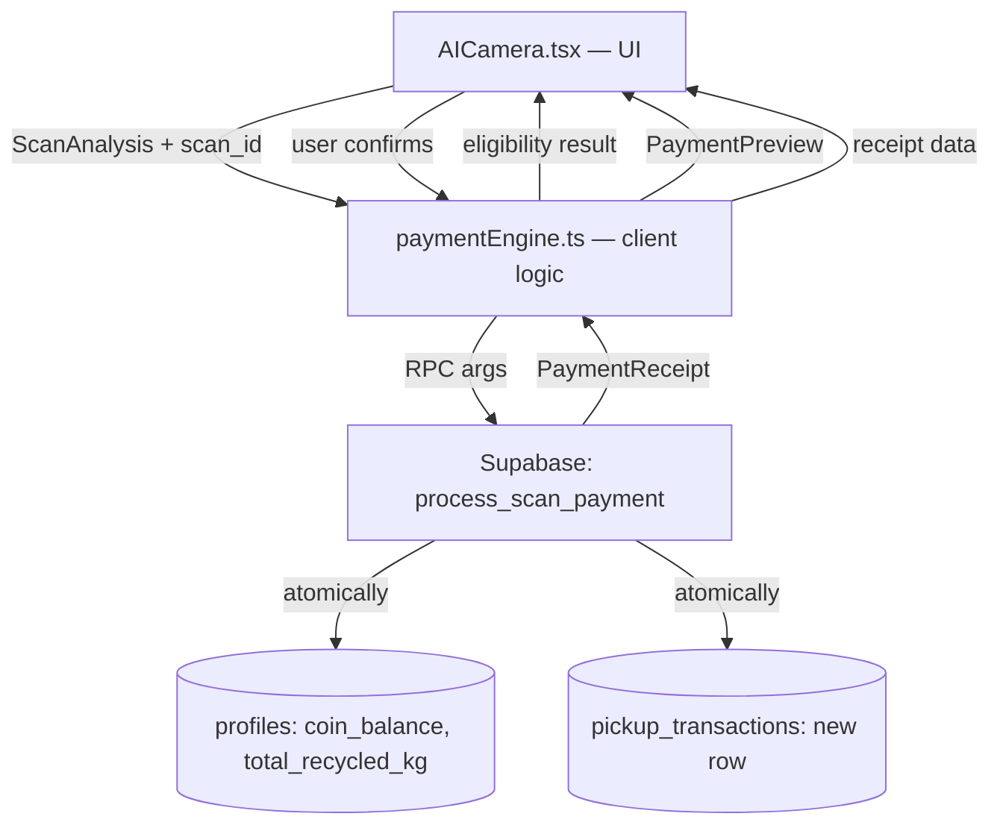
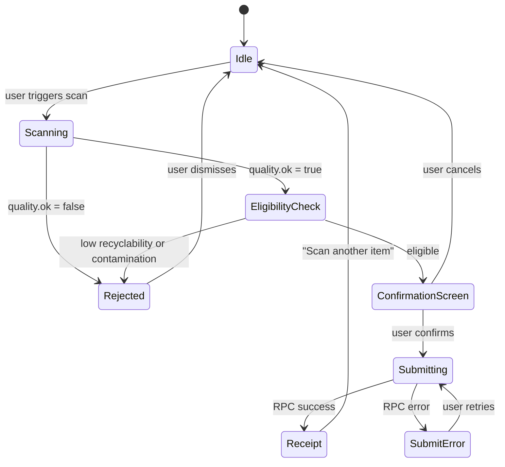

# Design Document — AI Camera Payment

## Overview

The AI Camera Payment feature wires the existing plastic scanner in `src/pages/picker/AICamera.tsx` into a full payment flow. After a successful scan, a client-side **Payment Engine** evaluates eligibility, calculates a coin reward, presents a confirmation screen, and calls a new Supabase RPC `process_scan_payment` that atomically credits the picker's balance and records the transaction. The feature is entirely within the Picker section; no Recycler involvement is required.

The flow is strictly linear:

```
Scan → Eligibility Check → Coin Calculation → Confirmation → RPC Call → Receipt
```

Any failure at any step either blocks progression or surfaces a recoverable error with a retry path.

---

## Architecture

### Component Layers



### State Machine (AICamera payment states)



---

## Components and Interfaces

### New file: `src/lib/plasticScan/paymentEngine.ts`

Encapsulates all payment logic, keeping `AICamera.tsx` as a pure UI layer.

```typescript
// Coin rates per kg by plastic type
export const COIN_RATES: Record<PlasticKind, number | null> = {
  PET:   100,
  HDPE:  90,
  PP:    85,
  LDPE:  60,
  PVC:   50,
  PS:    null,   // rejected
  Other: null,   // rejected
};

export type EligibilityResult =
  | { eligible: true }
  | { eligible: false; reason: "low_recyclability"; plasticType: PlasticKind }
  | { eligible: false; reason: "contamination"; contaminants: string[] }
  | { eligible: false; reason: "quality"; issues: string[] };

export type PaymentPreview = {
  scanId: string;
  items: Array<{ plasticType: PlasticKind; weightKg: number; coins: number }>;
  totalCoins: number;
  totalWeightKg: number;
  recyclability: RecyclabilityLevel;
};

export type PaymentReceipt = {
  transactionId: string;
  scanId: string;
  plasticTypes: PlasticKind[];
  weightKg: number;
  coinsEarned: number;
  newBalance: number;
  timestamp: string;
};

// Key exported functions:
// checkEligibility(analysis: ScanAnalysis): EligibilityResult
// calculatePayment(analysis: ScanAnalysis, scanId: string): PaymentPreview
// generateScanId(): string   — crypto.randomUUID()
// submitPayment(preview: PaymentPreview): Promise<PaymentReceipt>
```

### Modified: `src/pages/picker/AICamera.tsx`

Adds three new UI panels rendered conditionally based on payment state:

1. **PaymentConfirmationPanel** — shown after eligible scan, before RPC call
2. **PaymentReceiptPanel** — shown after successful RPC call
3. **PaymentRejectionBanner** — shown inline when scan is rejected

New state variables added to the existing component:
- `paymentState: 'idle' | 'confirming' | 'submitting' | 'receipt' | 'error'`
- `paymentPreview: PaymentPreview | null`
- `paymentReceipt: PaymentReceipt | null`
- `paymentError: string | null`

The `runAnalysis` function is extended: after setting `stage = 'done'`, it calls `checkEligibility` and `calculatePayment`, then transitions `paymentState` to `'confirming'` (eligible) or surfaces the rejection banner (ineligible).

### New Supabase migration: `supabase/migrations/20260405_scan_payment.sql`

- Alters `pickup_transactions` to make `recycler_id` nullable
- Adds `scan_id UUID UNIQUE` column to `pickup_transactions`
- Adds `plastic_type VARCHAR(16)` column to `pickup_transactions`
- Creates `process_scan_payment` RPC (see Data Models section)

### Modified: `src/integrations/supabase/types.ts`

- `pickup_transactions.recycler_id` becomes `string | null`
- `pickup_transactions.scan_id` added as `string`
- `pickup_transactions.plastic_type` added as `string | null`
- `process_scan_payment` function signature added to `Functions`

---

## Data Models

### `pickup_transactions` schema changes

| Column | Change | Notes |
|---|---|---|
| `recycler_id` | `NOT NULL` → nullable | Scan-originated transactions have no recycler |
| `scan_id` | NEW `UUID UNIQUE` | Idempotency key; null for QR-based transactions |
| `plastic_type` | NEW `VARCHAR(16)` | e.g. `"PET"`, `"HDPE"` |

### `process_scan_payment` RPC

```sql
CREATE OR REPLACE FUNCTION public.process_scan_payment(
  p_scan_id       UUID,
  p_plastic_type  VARCHAR,
  p_weight_kg     DOUBLE PRECISION,
  p_coins_earned  INT,
  p_scan_metadata JSONB DEFAULT '{}'
)
RETURNS JSONB
LANGUAGE plpgsql
SECURITY DEFINER
AS $$
DECLARE
  v_picker_id UUID := auth.uid();
  v_tx_id     UUID;
  v_new_balance INT;
BEGIN
  -- Auth guard
  IF v_picker_id IS NULL THEN
    RAISE EXCEPTION 'unauthorized' USING ERRCODE = 'P0401';
  END IF;

  -- Input validation
  IF p_weight_kg <= 0 THEN
    RAISE EXCEPTION 'invalid_weight' USING ERRCODE = 'P0020';
  END IF;
  IF p_coins_earned < 1 THEN
    RAISE EXCEPTION 'invalid_coins' USING ERRCODE = 'P0021';
  END IF;

  -- Atomic updates
  UPDATE public.profiles
  SET coin_balance      = coin_balance + p_coins_earned,
      total_recycled_kg = total_recycled_kg + p_weight_kg,
      total_points      = total_points + p_coins_earned,
      updated_at        = now()
  WHERE id = v_picker_id
  RETURNING coin_balance INTO v_new_balance;

  INSERT INTO public.pickup_transactions
    (picker_id, recycler_id, weight_kg, points_earned, scan_id, plastic_type)
  VALUES
    (v_picker_id, NULL, p_weight_kg, p_coins_earned, p_scan_id, p_plastic_type)
  RETURNING id INTO v_tx_id;

  RETURN jsonb_build_object(
    'transaction_id', v_tx_id,
    'scan_id',        p_scan_id,
    'coins_earned',   p_coins_earned,
    'new_balance',    v_new_balance,
    'timestamp',      now()
  );
END;
$$;
```

**Idempotency**: The `UNIQUE` constraint on `scan_id` causes a `unique_violation` (SQLSTATE `23505`) on duplicate calls. The client detects this code and shows "already processed" rather than an error.

### `PaymentPreview` (client-side, not persisted)

```typescript
{
  scanId: string;           // crypto.randomUUID(), generated once per scan
  items: [{
    plasticType: PlasticKind;
    weightKg: number;       // midpoint of weightEstimateGrams / 1000
    coins: number;          // round(weightKg * COIN_RATES[plasticType])
  }];
  totalCoins: number;       // max(1, sum of item coins)
  totalWeightKg: number;    // sum of item weightKg
  recyclability: RecyclabilityLevel;
}
```

---

## Correctness Properties

*A property is a characteristic or behavior that should hold true across all valid executions of a system — essentially, a formal statement about what the system should do. Properties serve as the bridge between human-readable specifications and machine-verifiable correctness guarantees.*

### Property 1: Quality gate blocks payment

*For any* `ScanAnalysis` where `quality.ok === false`, `checkEligibility` must return `eligible: false` and no `PaymentPreview` should be produced.

**Validates: Requirements 1.1, 1.2**

---

### Property 2: Low-recyclability rejection

*For any* `ScanAnalysis` whose primary `DetectedItem` has `plasticType` of `"PS"` or `"Other"`, `checkEligibility` must return `{ eligible: false, reason: "low_recyclability" }`.

**Validates: Requirements 2.1**

---

### Property 3: Contamination rejection

*For any* `ScanAnalysis` where at least one `DetectedItem` has a non-empty `contamination` array, `checkEligibility` must return `{ eligible: false, reason: "contamination" }`.

**Validates: Requirements 2.2**

---

### Property 4: Rejection reason is distinguishable

*For any* two rejection results — one with `reason: "low_recyclability"` and one with `reason: "contamination"` — the UI message strings produced must be different and non-empty.

**Validates: Requirements 2.4**

---

### Property 5: Coin calculation formula

*For any* eligible `DetectedItem` with `plasticType` in `{PET, HDPE, PP, LDPE, PVC}` and `weightEstimateGrams [lo, hi]`, the calculated coins must equal `Math.round(((lo + hi) / 2 / 1000) * COIN_RATES[plasticType])`.

**Validates: Requirements 3.1, 3.2**

---

### Property 6: Multi-item coin summation

*For any* list of eligible `DetectedItem` entries, `calculatePayment` must return `totalCoins` equal to the sum of individually calculated coins for each item (before the minimum-1 floor is applied).

**Validates: Requirements 3.3**

---

### Property 7: Minimum 1 coin guaranteed

*For any* eligible scan — including very low weight items — `calculatePayment` must return `totalCoins >= 1`.

**Validates: Requirements 3.5**

---

### Property 8: Confirmation screen contains all required fields

*For any* valid `PaymentPreview`, the rendered confirmation screen must include: detected plastic type(s), estimated weight range, calculated coin reward, and recyclability level.

**Validates: Requirements 4.1**

---

### Property 9: RPC atomically updates profile stats

*For any* valid call to `process_scan_payment` with `coins_earned = C` and `weight_kg = W`, the picker's `coin_balance` must increase by exactly `C` and `total_recycled_kg` must increase by exactly `W` in the same transaction.

**Validates: Requirements 5.2, 5.3**

---

### Property 10: RPC inserts exactly one transaction row with all required fields

*For any* valid call to `process_scan_payment`, exactly one row must be inserted into `pickup_transactions` containing the correct `picker_id`, `weight_kg`, `points_earned`, `scan_id`, and `plastic_type`.

**Validates: Requirements 5.4, 7.2**

---

### Property 11: Generated scan IDs are unique

*For any* two calls to `generateScanId()`, the returned UUIDs must be different.

**Validates: Requirements 7.1**

---

### Property 12: Duplicate scan_id calls are idempotent

*For any* `scan_id` that has already been used in a successful `process_scan_payment` call, a second call with the same `scan_id` must return a conflict error (SQLSTATE `23505`) and must not insert a second transaction row or modify the picker's balance a second time.

**Validates: Requirements 7.3**

---

## Error Handling

| Error condition | Source | Client behaviour |
|---|---|---|
| `quality.ok === false` | Scanner | Show quality hint toast; stay on scan view |
| Low recyclability | `checkEligibility` | Show rejection banner with plastic type; offer retake |
| Contamination | `checkEligibility` | Show rejection banner with contaminant list; offer retake |
| Network error on RPC | `supabase.rpc()` | Show retry button; preserve `PaymentPreview` in state |
| `23505` unique violation | RPC | Show "already processed" message (not an error) |
| `P0401` unauthorized | RPC | Redirect to `/auth/login` |
| `P0020` invalid weight | RPC | Show generic error; offer retry |
| `P0021` invalid coins | RPC | Show generic error; offer retry |
| User navigates away during `submitting` | React unmount | `paymentState` is discarded; no transaction created |
| User cancels on confirmation screen | UI | Reset `paymentState` to `'idle'`; no RPC call |

All RPC errors that are not `23505` surface a human-readable message derived from the Postgres error message, with a retry button that re-calls the RPC with the same `PaymentPreview` (no re-scan required).

---

## Testing Strategy

### Dual approach

Both unit tests and property-based tests are required. Unit tests cover specific examples, integration points, and error conditions. Property tests verify universal correctness across randomised inputs.

### Unit tests (Vitest)

- `checkEligibility` returns correct result for each rejection reason
- `calculatePayment` returns correct coins for each plastic type at a known weight
- Confirmation screen renders all required fields given a fixture `PaymentPreview`
- Receipt screen renders all required fields given a fixture `PaymentReceipt`
- Duplicate `scan_id` error is mapped to "already processed" message, not an error toast
- Unauthenticated user is redirected to login before confirmation screen is shown
- Cancel on confirmation screen resets state without calling the RPC
- Retry after network error re-calls RPC with the same `PaymentPreview`

### Property-based tests (fast-check, minimum 100 runs each)

Each property test maps directly to a Correctness Property above.

```
// Feature: ai-camera-payment, Property 1: Quality gate blocks payment
fc.property(arbitraryScanAnalysis({ qualityOk: false }), (analysis) => {
  const result = checkEligibility(analysis);
  return result.eligible === false;
})

// Feature: ai-camera-payment, Property 2: Low-recyclability rejection
fc.property(arbitraryScanAnalysisWithPrimary(["PS", "Other"]), (analysis) => {
  const result = checkEligibility(analysis);
  return !result.eligible && result.reason === "low_recyclability";
})

// Feature: ai-camera-payment, Property 3: Contamination rejection
fc.property(arbitraryScanAnalysisWithContamination(), (analysis) => {
  const result = checkEligibility(analysis);
  return !result.eligible && result.reason === "contamination";
})

// Feature: ai-camera-payment, Property 4: Rejection reason is distinguishable
fc.property(
  fc.constantFrom("low_recyclability" as const, "contamination" as const),
  fc.constantFrom("low_recyclability" as const, "contamination" as const),
  (r1, r2) => {
    if (r1 === r2) return true;
    return getRejectionMessage(r1) !== getRejectionMessage(r2);
  }
)

// Feature: ai-camera-payment, Property 5: Coin calculation formula
fc.property(arbitraryEligibleDetectedItem(), (item) => {
  const midKg = (item.weightEstimateGrams[0] + item.weightEstimateGrams[1]) / 2 / 1000;
  const expected = Math.round(midKg * COIN_RATES[item.plasticType]!);
  return calculateItemCoins(item) === expected;
})

// Feature: ai-camera-payment, Property 6: Multi-item coin summation
fc.property(fc.array(arbitraryEligibleDetectedItem(), { minLength: 1 }), (items) => {
  const preview = calculatePayment({ items } as ScanAnalysis, "test-id");
  const sum = items.reduce((acc, it) => acc + calculateItemCoins(it), 0);
  return preview.totalCoins === Math.max(1, sum);
})

// Feature: ai-camera-payment, Property 7: Minimum 1 coin guaranteed
fc.property(arbitraryEligibleScanAnalysis(), (analysis) => {
  const preview = calculatePayment(analysis, crypto.randomUUID());
  return preview.totalCoins >= 1;
})

// Feature: ai-camera-payment, Property 8: Confirmation screen contains all required fields
fc.property(arbitraryPaymentPreview(), (preview) => {
  const html = renderConfirmationScreen(preview);
  return (
    preview.items.every(it => html.includes(it.plasticType)) &&
    html.includes(String(preview.totalCoins)) &&
    html.includes(preview.recyclability)
  );
})

// Feature: ai-camera-payment, Property 11: Generated scan IDs are unique
fc.property(fc.integer({ min: 2, max: 50 }), (n) => {
  const ids = Array.from({ length: n }, () => generateScanId());
  return new Set(ids).size === n;
})
```

Properties 9, 10, and 12 require a live Supabase instance and are implemented as integration tests rather than pure unit property tests, but still follow the property pattern with randomised inputs (random weights, coin amounts, plastic types).

### Property-based testing library

**fast-check** (`npm install --save-dev fast-check`) — chosen for its TypeScript-first API, shrinking support, and compatibility with Vitest.

Each property test must run a minimum of **100 iterations** (fast-check default is 100; set explicitly via `{ numRuns: 100 }`).

Tag format for each test: `// Feature: ai-camera-payment, Property N: <property_text>`
